# Hardware Abstraction Layer (HAL) Workflow Documentation

## Overview

The Hardware Abstraction Layer (HAL) is a comprehensive abstraction system designed to manage hardware components of the Openterface Mini KVM. It provides a unified interface for detecting, initializing, and managing video and control chipsets, while integrating seamlessly with existing application managers.

## HAL Workflow Diagram

```mermaid
flowchart TD
    Start["🚀 Application Launch"] --> AppDelegate["📱 AppDelegate"]
    AppDelegate --> AppLaunch["applicationDidFinishLaunching"]
    
    AppLaunch --> InitHAL["🔧 initializeHAL()"]
    
    InitHAL --> HALIntegration["📦 HALIntegrationManager.shared"]
    HALIntegration --> InitHALIntegration["initializeHALIntegration()"]
    
    InitHALIntegration --> HardwareDet["🔍 HAL.detectAndInitializeHardware()"]
    
    HardwareDet --> VideoDetect["🎬 detectVideoChipset()"]
    HardwareDet --> ControlDetect["🎮 detectControlChipset()"]
    
    VideoDetect --> CheckMS2109["Check MS2109"]
    CheckMS2109 --> MS2109Found{MS2109 Found?}
    MS2109Found -->|Yes| InitMS2109["Initialize MS2109"]
    InitMS2109 --> MS2109Success{Success?}
    MS2109Success -->|Yes| VideoOK["✅ Video Chipset OK"]
    MS2109Success -->|No| CheckMS2109S["Check MS2109S"]
    MS2109Found -->|No| CheckMS2109S
    
    CheckMS2109S --> MS2109SFound{MS2109S Found?}
    MS2109SFound -->|Yes| InitMS2109S["Initialize MS2109S"]
    InitMS2109S --> MS2109SSuccess{Success?}
    MS2109SSuccess -->|Yes| VideoOK
    MS2109SSuccess -->|No| CheckMS2130S["Check MS2130S"]
    MS2109SFound -->|No| CheckMS2130S
    
    CheckMS2130S --> MS2130SFound{MS2130S Found?}
    MS2130SFound -->|Yes| InitMS2130S["Initialize MS2130S"]
    InitMS2130S --> MS2130SSuccess{Success?}
    MS2130SSuccess -->|Yes| VideoOK
    MS2130SSuccess -->|No| VideoFail["⚠️ Video Chipset Failed"]
    MS2130SFound -->|No| VideoFail
    
    VideoOK --> ContDetCheck["✅ Control Detection"]
    VideoFail --> ContDetCheck
    
    ControlDetect --> CheckCH9329["Check CH9329"]
    CheckCH9329 --> CH9329Found{CH9329 Found?}
    CH9329Found -->|Yes| InitCH9329["Initialize CH9329"]
    InitCH9329 --> CH9329Success{Success?}
    CH9329Success -->|Yes| ControlOK["✅ Control Chipset OK"]
    CH9329Success -->|No| CheckCH32V208["Check CH32V208"]
    CH9329Found -->|No| CheckCH32V208
    
    CheckCH32V208 --> CH32V208Found{CH32V208 Found?}
    CH32V208Found -->|Yes| InitCH32V208["Initialize CH32V208"]
    InitCH32V208 --> CH32V208Success{Success?}
    CH32V208Success -->|Yes| ControlOK
    CH32V208Success -->|No| ControlFail["⚠️ Control Chipset Failed"]
    CH32V208Found -->|No| ControlFail
    
    ControlOK --> PeriodicSetup["⏰ setupPeriodicHALUpdates"]
    ControlFail --> PeriodicSetup
    
    PeriodicSetup --> CreateTimer["Create DispatchSourceTimer"]
    CreateTimer --> MonitorHW["Monitor Hardware Every 2s"]
    
    MonitorHW --> IntegrationStart["🔗 integrateWithAllManagers"]
    
    IntegrationStart --> VideoMgr["Integrate VideoManager"]
    IntegrationStart --> HIDMgr["Integrate HIDManager"]
    IntegrationStart --> SerialMgr["Integrate SerialPortManager"]
    
    VideoMgr --> ResolveBag1["Resolve from DependencyContainer"]
    ResolveBag1 --> LogVideo["📋 Log Video Capabilities"]
    LogVideo --> VideoResolutions["Display Supported Resolutions"]
    
    HIDMgr --> ResolveBag2["Resolve from DependencyContainer"]
    ResolveBag2 --> InitHALAware["initializeHALAwareHID()"]
    InitHALAware --> HIDHALReady{HAL-Aware OK?}
    HIDHALReady -->|Yes| LogHID["📊 Log HID System Info"]
    HIDHALReady -->|No| LogHIDFail["⚠️ HAL-Aware HID Failed"]
    LogHID --> ChipsetConfig["🎮 Chipset-Specific Config"]
    LogHIDFail --> ChipsetConfig
    
    SerialMgr --> ResolveBag3["Resolve from DependencyContainer"]
    ResolveBag3 --> ConfigSerial["Configure Based on Chipset"]
    ConfigSerial --> LogSerial["📋 Log Control Features"]
    
    ChipsetConfig --> ConfigCH9329{CH9329?}
    ConfigCH9329 -->|Yes| SetupCH9329["⌨️ Setup Keyboard/Mouse Emulation<br/>📡 Enable CTS Monitoring<br/>🔄 Hybrid Communication"]
    ConfigCH9329 -->|No| ConfigCH32V208{CH32V208?}
    ConfigCH32V208 -->|Yes| SetupCH32V208["Setup CH32V208 Features"]
    ConfigCH32V208 -->|No| SetupUnknown["Use Generic Config"]
    
    SetupCH9329 --> EEPROM["EEPROM Support?"]
    SetupCH32V208 --> EEPROM
    SetupUnknown --> EEPROM
    
    EEPROM --> ConfigEEPROM["Configure EEPROM Operations"]
    
    LogVideo --> FinalIntegration["✅ Integration Complete"]
    LogSerial --> FinalIntegration
    ConfigEEPROM --> FinalIntegration
    
    FinalIntegration --> LogStatus["Log HAL Status"]
    LogStatus --> Success["✅ HAL Initialized Successfully"]
    
    Success --> Running["🎯 Application Running"]
    
    Running --> Monitor["Periodic Monitoring Active"]
    Monitor --> CheckConnection["Check Hardware Connection"]
    CheckConnection --> UpdateStatus["Update AppStatus"]
    UpdateStatus --> Monitor
    
    Running --> UserAction["User Interaction"]
    UserAction --> UseHAL["Use HAL APIs via Manager Extensions"]
    UseHAL --> HardwareOp["Execute Hardware Operation"]
    HardwareOp --> Running
    
    Running --> Terminate["Application Terminate Event"]
    Terminate --> StopMonitor["stopPeriodicHALUpdates"]
    StopMonitor --> DeinitHAL["deinitializeHardware"]
    DeinitHAL --> ReleaseResources["Release Hardware Resources"]
    ReleaseResources --> End["🛑 Application End"]
    
    style Start fill:#e1f5e1
    style End fill:#ffe1e1
    style Success fill:#e1f0ff
    style Running fill:#fff4e1
    style VideoOK fill:#e1ffe1
    style ControlOK fill:#e1ffe1
    style Monitor fill:#fff0f5
```



## Architecture

### Key Components

```mermaid
graph TB
    subgraph AppLayer["Application Layer"]
        AppDelegate["📱 AppDelegate<br/>Application Entry Point"]
    end
    
    subgraph HALLayer["HAL Integration Layer"]
        HALIntegrationManager["📦 HALIntegrationManager<br/>Singleton Manager<br/>- initializeHALIntegration<br/>- integrateWithVideoManager<br/>- integrateWithHIDManager<br/>- integrateWithSerialPortManager<br/>- setupPeriodicHALUpdates"]
    end
    
    subgraph CoreHALLayer["Core HAL Layer"]
        HardwareAbstractionLayer["🔧 HardwareAbstractionLayer<br/>Central HAL Coordinator<br/>- detectAndInitializeHardware<br/>- getCurrentVideoChipset<br/>- getCurrentControlChipset<br/>- Periodic monitoring"]
    end
    
    subgraph VideoChipsetsLayer["Video Chipset Implementations"]
        BaseVideoChipset["📺 BaseVideoChipset<br/>Base class for video chipsets<br/>- detectDevice<br/>- initialize<br/>- getResolution<br/>- getFrameRate"]
        MS2109["MS2109 Chipset<br/>Standard video capture"]
        MS2109S["MS2109S Chipset<br/>Enhanced version"]
        MS2130S["MS2130S Chipset<br/>Latest generation"]
    end
    
    subgraph ControlChipsetsLayer["Control Chipset Implementations"]
        BaseControlChipset["🎮 BaseControlChipset<br/>Base class for control chipsets<br/>- establishCommunication<br/>- sendAsyncCommand<br/>- getDeviceStatus"]
        CH9329["CH9329 Chipset<br/>Keyboard/Mouse emulation"]
        CH32V208["CH32V208 Chipset<br/>Alternative control"]
    end
    
    AppDelegate -->|initializes| HALIntegrationManager
    HALIntegrationManager -->|coordinates| HardwareAbstractionLayer
    
    HardwareAbstractionLayer -->|detects & manages| BaseVideoChipset
    BaseVideoChipset -->|subclassed by| MS2109
    BaseVideoChipset -->|subclassed by| MS2109S
    BaseVideoChipset -->|subclassed by| MS2130S
    
    HardwareAbstractionLayer -->|detects & manages| BaseControlChipset
    BaseControlChipset -->|subclassed by| CH9329
    BaseControlChipset -->|subclassed by| CH32V208
    
    style AppLayer fill:#e1f5e1
    style HALLayer fill:#e1f0ff
    style CoreHALLayer fill:#fff4e1
    style VideoChipsetsLayer fill:#ffe1f5
    style ControlChipsetsLayer fill:#f5e1ff
```



### Core Files

| File | Purpose |
|------|---------|
| `HALIntegration.swift` | Main integration manager, bridges HAL with application managers |
| `HardwareAbstractionLayer.swift` | Core HAL system, hardware detection, and initialization |
| `VideoChipsetHAL.swift` | Video chipset implementations (MS2109, MS2109S, MS2130S, etc.) |
| `ControlChipsetHAL.swift` | Control chipset implementations (CH9329, CH32V208, etc.) |

## Initialization Workflow

### 1. Application Launch Phase

When the application launches, the AppDelegate's `applicationDidFinishLaunching()` method is called:

```swift
func applicationDidFinishLaunching(_ aNotification: Notification) {
    // ... other initialization code ...
    
    // Initialize Hardware Abstraction Layer
    initializeHAL()
    
    // ... rest of initialization ...
}

private func initializeHAL() {
    logger.log(content: "Initializing Hardware Abstraction Layer...")
    
    let halIntegration = HALIntegrationManager.shared
    
    if halIntegration.initializeHALIntegration() {
        // Integrate HAL with existing managers
        halIntegration.integrateWithVideoManager()
        halIntegration.integrateWithHIDManager()
        halIntegration.integrateWithSerialPortManager()
        
        logger.log(content: "✅ Hardware Abstraction Layer initialized successfully")
    } else {
        logger.log(content: "⚠️ Hardware Abstraction Layer initialization failed - falling back to legacy mode")
    }
}
```

### 2. HAL Integration Initialization

`HALIntegrationManager.initializeHALIntegration()` performs the following steps:

#### Step 2.1: Hardware Detection and Initialization

```
initializeHALIntegration()
    └─> hal.detectAndInitializeHardware()
        ├─> detectVideoChipset()
        │   └─> Check for supported video chipsets (MS2109, MS2109S, MS2130S, etc.)
        │       └─> If found:
        │           ├─> Call chipset.detectDevice()
        │           ├─> Call chipset.initialize()
        │           └─> Set AppStatus.videoChipsetType
        │
        └─> detectControlChipset()
            └─> Check for supported control chipsets (CH9329, CH32V208, etc.)
                └─> If found:
                    ├─> Call chipset.detectDevice()
                    ├─> Call chipset.initialize()
                    └─> Store in HAL's controlChipset
```

#### Step 2.2: Setup Periodic HAL Updates

```
setupPeriodicHALUpdates()
    └─> Create a DispatchSourceTimer on utility queue
        └─> Every 2 seconds (default):
            ├─> Update video chipset status
            ├─> Update control chipset status
            ├─> Check hardware connectivity
            └─> Log periodic status information
```

#### Step 2.3: Integrate with Application Managers

```
integrateWithAllManagers()
    ├─> integrateWithVideoManager()
    │   └─> Resolve VideoManagerProtocol from DependencyContainer
    │   └─> Log video capabilities and supported resolutions
    │
    ├─> integrateWithHIDManager()
    │   ├─> Resolve HIDManagerProtocol from DependencyContainer
    │   ├─> Call hidManager.initializeHALAwareHID()
    │   └─> Log HID capabilities
    │
    ├─> integrateWithSerialPortManager()
    │   ├─> Resolve SerialPortManagerProtocol from DependencyContainer
    │   ├─> Configure serial communication based on chipset
    │   └─> Log supported control features
    │
    └─> integrateControlChipsetWithManagers()
        └─> integrateControlChipsetWithHIDManager()
            └─> Chipset-specific configuration (CH9329, CH32V208, etc.)
```

## Chipset Detection and Initialization

### Video Chipset Detection

The HAL automatically detects video chipsets in this order:

```
1. MS2109 Chipset
   └─> Typical for standard Openterface Mini KVM devices
   └─> Supports: HDMI capture, audio capture, various resolutions
   
2. MS2109S Chipset
   └─> Enhanced version with improved features
   
3. MS2130S Chipset
   └─> Latest generation with additional capabilities
   
4. Additional chipsets (as support is added)
```

### Control Chipset Detection

Control chipsets are detected and managed similarly:

```
1. CH9329 Chipset
   └─> Typical control chipset for keyboard/mouse emulation
   └─> Supports: Serial + HID hybrid communication
   └─> Features: Keyboard emulation, Mouse emulation
   
2. CH32V208 Chipset
   └─> Alternative control chipset
   
3. Additional chipsets (as support is added)
```

## Manager Integration Details

### 1. Video Manager Integration

**Purpose**: Enable video capture and resolution detection through HAL-aware interface

```swift
integrateWithVideoManager() {
    // Access video chipset capabilities
    if videoChipset.capabilities.supportsHDMI {
        // Enable HDMI-specific features
    }
    
    if videoChipset.capabilities.supportsAudio {
        // Enable audio capture features
    }
    
    // Log supported resolutions
    let resolutions = videoChipset.supportedResolutions
    // Device-aware resolution handling
}
```

**Extension Protocol**:
```swift
extension VideoManagerProtocol {
    var halVideoChipset: VideoChipsetProtocol? { ... }
    var halVideoCapabilities: ChipsetCapabilities? { ... }
    func halSupportsFeature(_ feature: String) -> Bool { ... }
}
```

### 2. HID Manager Integration

**Purpose**: Enable HAL-aware HID operations for keyboard/mouse control

```swift
integrateWithHIDManager() {
    // Initialize HAL-aware HID if supported
    if hidManagerImpl.initializeHALAwareHID() {
        // Get system information from HAL
        let systemInfo = hidManagerImpl.getHALSystemInfo()
        
        // Get HID capabilities
        let capabilities = hidManagerImpl.getHALHIDCapabilities()
    }
    
    // Configure based on chipset
    if controlChipset.capabilities.supportsHID { ... }
    if controlChipset.capabilities.supportsEEPROM { ... }
}
```

**Chipset-Specific Configuration**:

For **CH9329**:
```
• Enable CTS monitoring for HID events
• Setup hybrid serial + HID communication
• Configure keyboard emulation
• Configure mouse emulation
```

For **CH32V208**:
```
• Similar configuration patterns
• Different register mappings (if applicable)
```

**Extension Protocol**:
```swift
extension HIDManagerProtocol {
    var halControlChipset: ControlChipsetProtocol? { ... }
    var halControlCapabilities: ChipsetCapabilities? { ... }
    func halSupportsFeature(_ feature: String) -> Bool { ... }
}
```

### 3. Serial Port Manager Integration

**Purpose**: Configure serial communication based on detected control chipset

```swift
integrateWithSerialPortManager() {
    // Configure based on communication interface
    switch controlChipset.communicationInterface {
    case .serial(let baudRate):
        // Configure serial at specified baud rate
        
    case .hid(let reportSize):
        // Configure HID with report size
        
    case .hybrid(let serial, let hid):
        // Setup both serial and HID interfaces
    }
    
    // Log supported control features
    let features = controlChipset.capabilities.features
}
```

**Extension Protocol**:
```swift
extension SerialPortManagerProtocol {
    var halControlChipset: ControlChipsetProtocol? { ... }
    var halSupportedBaudRates: [Int] { ... }
    func halSupportsCommunicationInterface(_ interface: CommunicationInterface) -> Bool { ... }
}
```

## Data Flow Architecture

### Hardware Access Flow

```
Application Code
    │
    ▼
Manager Protocols (VideoManager, HIDManager, SerialPortManager)
    │
    ├──► HAL Extension Methods (halVideoChipset, halControlChipset, etc.)
    │
    ▼
HALIntegrationManager
    │
    ▼
HardwareAbstractionLayer
    │
    ├──► VideoChipsetProtocol (MS2109, MS2109S, etc.)
    │    └──► Low-level video hardware operations
    │
    └──► ControlChipsetProtocol (CH9329, CH32V208, etc.)
         └──► Low-level control hardware operations
```

### Resolution Query Flow

Example: Getting input resolution through HAL:

```
Application
    │
    ▼
HIDManager.getResolution()
    │
    ▼
HIDManager checks if HAL-aware initialization succeeded
    │
    ├─ YES ──> halVideoChipset.getResolution()
    │            └─> Direct hardware query via video chipset
    │
    └─ NO ──> Legacy getResolution() method
               └─> Use existing serial/HID protocol
```

## Periodic Monitoring

The HAL system includes a periodic update mechanism that:

```
Every 2 seconds (configurable):
├─> Check video chipset connectivity status
├─> Verify control chipset communication
├─> Update AppStatus with hardware information
├─> Log hardware state changes
└─> Detect hardware disconnection events
```

This ensures the application always has current hardware status information without requiring explicit polling.

## Deinitialization Workflow

When the application terminates:

```
applicationShouldTerminate()
    │
    ▼
deinitializeHAL()
    │
    ├─> HALIntegrationManager.stopPeriodicHALUpdates()
    │   └─> Invalidate and cleanup DispatchSourceTimer
    │
    └─> HardwareAbstractionLayer.deinitializeHardware()
        ├─> Deinitialize video chipset
        ├─> Deinitialize control chipset
        └─> Release hardware resources
```

## Error Handling and Fallback

The HAL system includes graceful degradation:

```
Hardware Detection Phase:
├─> If no HAL chipsets detected
│   └─> Log warning about limited functionality
│   └─> Application can continue in legacy mode
│
Integration Phase:
├─> If HAL integration fails
│   └─> Log failure with reason
│   └─> Fall back to legacy manager implementations
│
Runtime Phase:
├─> If chipset becomes disconnected
│   └─> Periodic monitoring detects this
│   └─> Updates AppStatus.isTargetConnected
│   └─> Application UI responds accordingly
```

## Chipset-Specific Information

### VideoChipsetHIDRegisters Protocol

Each video chipset implements register mappings for HID operations:

```swift
protocol VideoChipsetHIDRegisters {
    // Resolution Registers
    var inputResolutionWidthHigh: UInt16
    var inputResolutionWidthLow: UInt16
    var inputResolutionHeightHigh: UInt16
    var inputResolutionHeightLow: UInt16
    
    // Frame Rate Registers
    var fpsHigh: UInt16
    var fpsLow: UInt16
    
    // Pixel Clock Registers
    var pixelClockHigh: UInt16
    var pixelClockLow: UInt16
    
    // Timing Registers (H/V total, start, width)
    var inputHTotalHigh/Low, inputVTotalHigh/Low
    var inputHstHigh/Low, inputVstHigh/Low
    var inputHwHigh/Low, inputVwHigh/Low
    
    // Status Registers
    var hdmiConnectionStatus: UInt16
    var softwareSwitchStatus: UInt16
    var hardwareSwitchStatus: UInt16
}
```

These registers allow chipset-specific hardware queries while maintaining a unified interface.

## Key Capabilities

### ChipsetCapabilities Structure

```swift
struct ChipsetCapabilities {
    let supportsHDMI: Bool              // HDMI input support
    let supportsAudio: Bool              // Audio capture support
    let supportsHID: Bool                // HID control support
    let supportsFirmwareUpdate: Bool     // Firmware update capability
    let supportsEEPROM: Bool             // EEPROM read/write
    let maxDataTransferRate: UInt64      // Maximum transfer rate
    let features: [String]               // List of supported features
}
```

## Integration Points with Existing Code

### AppDelegate Integration

```swift
// Line 239 in AppDelegate.swift
private func initializeHAL() {
    let halIntegration = HALIntegrationManager.shared
    
    if halIntegration.initializeHALIntegration() {
        halIntegration.integrateWithVideoManager()
        halIntegration.integrateWithHIDManager()
        halIntegration.integrateWithSerialPortManager()
    }
}

// During termination
func applicationShouldTerminate(_ sender: NSApplication) -> NSApplication.TerminateReply {
    deinitializeHAL()
    return .terminateNow
}
```

### DependencyContainer Integration

All manager protocols are registered in the DependencyContainer:

```swift
static func setupDependencies(container: DependencyContainer) {
    container.register(VideoManagerProtocol.self, instance: VideoManager.shared)
    container.register(HIDManagerProtocol.self, instance: HIDManager.shared)
    container.register(SerialPortManagerProtocol.self, instance: SerialPortManager.shared)
    // ... more registrations ...
}
```

HAL accesses these managers through the container:

```swift
let videoManager = DependencyContainer.shared.resolve(VideoManagerProtocol.self)
let hidManager = DependencyContainer.shared.resolve(HIDManagerProtocol.self)
```

## Benefits of the HAL Architecture

1. **Hardware Abstraction**: Decouples application code from hardware specifics
2. **Scalability**: Easy to add support for new chipsets
3. **Unified Interface**: Same protocols for different chipset implementations
4. **Backward Compatibility**: Falls back to legacy mode if HAL unavailable
5. **Device-Aware Features**: Features adapt based on detected hardware
6. **Monitoring**: Continuous hardware status tracking
7. **Extensibility**: Protocol extensions add HAL features to existing managers without modification

## Future Enhancement Areas

1. **Multiple Chipset Support**: Handle systems with multiple chipsets simultaneously
2. **Dynamic Chipset Switching**: Support runtime chipset selection
3. **Advanced Diagnostics**: More detailed hardware health monitoring
4. **Performance Metrics**: Track and optimize hardware communication performance
5. **Firmware Management**: Unified firmware update interface across chipsets
6. **Custom Chipset Extensions**: Plugin architecture for vendor-specific implementations
