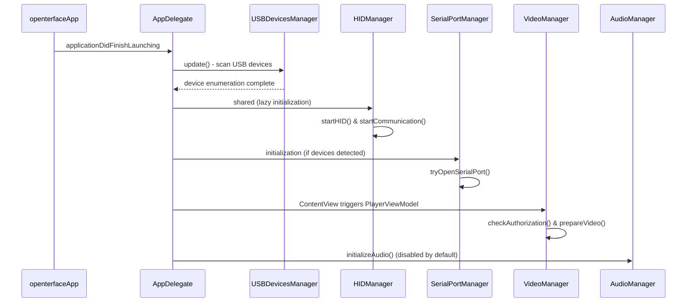

# Openterface Mini KVM MacOS Application - Project Summary

## 🎯 Project Overview

The **Openterface Mini KVM** is a macOS application that provides KVM (Keyboard, Video, Mouse) functionality through a hardware device. It allows users to control a headless target device (such as servers, mini PCs, or kiosks) directly from their macOS computer without requiring separate keyboard, mouse, and monitor for the target device.

### Key Features
- ✅ Basic KVM operations
- ✅ Mouse control (absolute and relative modes)
- ✅ Audio streaming from target device
- ✅ Text pasting to target device
- ✅ OCR text recognition from target device
- ✅ HDMI and keyboard/mouse connection indicators
- ✅ Special keys support (F1-F12, Del, Ctrl+Alt+Del)
- ✅ Keystroke macro support
- ✅ Firmware update capabilities
- 🔄 Custom keyboard layout support (planned)
- 🔄 Audio bypass from target to host (requires additional hardware)

## 🏗️ Project Architecture

The application follows a **Protocol-Oriented Architecture** with dependency injection for improved testability and maintainability:

### Core Architecture Principles
- **Protocol-First Design**: All major components are defined by protocols
- **Dependency Injection**: Uses a centralized container for managing dependencies
- **Separation of Concerns**: Clear boundaries between different layers
- **Testability**: Easy mocking and unit testing through protocol abstractions

### Core Components

```
┌─────────────────────────────────────────────────────────────────┐
│                        openterfaceApp                           │
│                      (Main SwiftUI App)                        │
└─────────────────────┬───────────────────────────────────────────┘
                      │
┌─────────────────────▼───────────────────────────────────────────┐
│                   AppDelegate                                   │
│         (Application lifecycle & window management)            │
│               Uses Protocol-Based Dependencies                 │
└─────────────────────┬───────────────────────────────────────────┘
                      │
┌─────────────────────▼───────────────────────────────────────────┐
│                   ContentView                                  │
│            (Main UI container with PlayerViewModel)            │
└─────────────────────┬───────────────────────────────────────────┘
                      │
┌─────────────────────▼───────────────────────────────────────────┐
│              PlayerContainerView                               │
│         (Video display NSViewRepresentable wrapper)           │
└─────────────────────────────────────────────────────────────────┘
```

### Protocol-Based Manager System

The application uses protocol-oriented managers with dependency injection:

```
┌─────────────────────────────────────────────────────────────────┐
│                    DependencyContainer                         │
│                   (Centralized DI Container)                   │
└─────────────────────┬───────────────────────────────────────────┘
                      │
        ┌─────────────┴─────────────┐
        │                           │
        ▼                           ▼
┌───────────────┐           ┌───────────────┐
│   Protocols   │           │ Implementations│
│              │           │               │
│ • VideoManager│◄──────────► VideoManager │
│ • HIDManager  │           │ • HIDManager  │
│ • AudioManager│           │ • AudioManager│
│ • SerialPort  │           │ • SerialPort  │
│ • Logger      │           │ • Logger      │
│ • USB Devices │           │ • USB Devices │
│ • Firmware    │           │ • Firmware    │
│ • StatusBar   │           │ • StatusBar   │
│ • Host/Target │           │ • Host/Target │
└───────────────┘           └───────────────┘
```

#### 🎥 VideoManager
- **Purpose**: Handles video capture from the target device
- **Key Features**:
  - AVCaptureSession management
  - Video device detection and connection handling
  - Hot-plug support for video devices
  - Resolution detection and aspect ratio management
  - Video session lifecycle management

#### 🔌 HIDManager
- **Purpose**: Manages HID (Human Interface Device) communication with the KVM hardware
- **Key Features**:
  - Low-level HID device communication
  - Hardware status monitoring (HDMI signal, switches)
  - Resolution and FPS reading from hardware
  - EEPROM operations for firmware updates
  - Hardware connection status detection

#### 📡 SerialPortManager
- **Purpose**: Handles serial communication with the control chip
- **Key Features**:
  - Multi-chipset support (CH9329, CH32V208)
  - Automatic baudrate detection and configuration
  - Command/response protocol handling
  - Device validation and readiness checking
  - CTS (Clear To Send) monitoring for HID events

#### 🔊 AudioManager
- **Purpose**: Manages audio streaming from target device
- **Key Features**:
  - Audio device detection ("OpenterfaceA")
  - Microphone permission handling
  - Audio engine management
  - Device hot-plug support
  - Audio session lifecycle management

#### 🖥️ USBDevicesManager
- **Purpose**: USB device enumeration and management
- **Key Features**:
  - USB device discovery and grouping
  - Chipset identification (MS2109, MS2130, CH9329, CH32V208)
  - Device correlation and matching
  - Location ID management

#### ⚙️ FirmwareManager
- **Purpose**: Handles firmware update operations
- **Key Features**:
  - Firmware validation and checksum verification
  - EEPROM write operations
  - Update progress tracking
  - Rollback and recovery mechanisms

## 🚀 Application Initialization & Workflow

### 1. Application Launch Sequence



### 2. Device Connection Workflow

```mermaid
flowchart TD
    A[USB Device Connected] --> B[USBDevicesManager.update()]
    B --> C{Device Type?}
    
    C -->|Video Device| D[VideoManager.videoWasConnected]
    C -->|Control Chip| E[SerialPortManager.tryOpenSerialPort]
    C -->|Audio Device| F[AudioManager device detection]
    
    D --> G[Update video session]
    E --> H[Establish serial communication]
    F --> I[Setup audio streaming]
    
    G --> J[HIDManager.startHID()]
    H --> J
    I --> J
    
    J --> K[Begin KVM operations]
```

### 3. Core Operation Loop

Once initialized, the application runs several concurrent operations:

#### HID Communication Timer (1s interval)
- Reads hardware status (switch position, HDMI signal)
- Monitors target device connection
- Updates resolution and FPS information
- Tracks hardware metrics

#### Serial Communication
- Processes incoming HID events and status updates
- Handles keyboard/mouse command acknowledgments
- Monitors device readiness and connection status

#### Video Session Management
- Maintains AVCaptureSession for video streaming
- Handles device hot-plug events
- Manages resolution changes and aspect ratio

#### Audio Session Management
- Streams audio from target device
- Monitors audio device connection status
- Handles microphone permissions

## 📁 Project Structure

```
openterface/
├── App Entry Points
│   ├── openterfaceApp.swift           # Main SwiftUI application
│   ├── AppDelegate.swift              # App lifecycle & window management
│   └── ContentView.swift              # Main UI container
│
├── Managers/                          # Core business logic
│   ├── AudioManager.swift             # Audio streaming management
│   ├── FirmwareManager.swift          # Firmware update operations
│   ├── HIDManager.swift               # HID device communication
│   ├── LoggerManager.swift            # Logging system
│   ├── SerialportManger.swift         # Serial communication
│   ├── StatusBarManager.swift         # macOS status bar integration
│   ├── TipLayerManager.swift          # UI tooltips and hints
│   ├── VideoManager.swift             # Video capture management
│   └── Host/                          # Host-specific managers
│       ├── HostManager.swift          # Host system integration
│       ├── KeyboardManager.swift      # Keyboard event handling
│       ├── MouseManager.swift         # Mouse event handling
│       └── USBDevicesManager.swift    # USB device enumeration
│
├── Views/                             # SwiftUI UI components
│   ├── EdidNameView.swift             # EDID information display
│   ├── FirmwareUpdateView.swift       # Firmware update UI
│   ├── KeysView.swift                 # Special keys interface
│   ├── PlayerContainerView.swift      # Video player container
│   ├── PlayerView.swift               # Core video display
│   ├── ResetFactoryView.swift         # Factory reset interface
│   ├── SettingsScreen.swift           # Application settings
│   ├── ToolBarView.swift              # Main toolbar
│   ├── USBDevicesView.swift           # Device status display
│   └── WindowUtils.swift              # Window management utilities
│
├── ViewModels/                        # MVVM view models
│   ├── PlayerViewModel.swift          # Video player logic
│   └── VideoOutputDelegate.swift      # Video output handling
│
├── Settings/                          # Configuration management
│   ├── AppStatus.swift                # Global application state
│   └── UserSetting.swift              # User preferences
│
├── ShotOrc/                           # Screenshot functionality
│   ├── AreaSeletor.swift              # Screen area selection
│   └── SCContext.swift                # Screenshot context
│
└── Assets.xcassets/                   # App resources and icons
```

## 🔧 Hardware Support

### Supported Chipsets

#### Video Capture Chips
- **MS2109**: Primary video capture chipset
- **MS2130**: Alternative video capture chipset

#### Control Chips
- **CH9329**: HID control chip with CTS monitoring
- **CH32V208**: Advanced control chip with direct serial communication

### Communication Protocols

#### HID Protocol
- Vendor ID: 0x534D, Product ID: 0x2109 (MS2109)
- Vendor ID: 0x345F, Product ID: 0x2130 (MS2130)
- Report-based communication for hardware control

#### Serial Protocol
- **Baudrates**: 9600 (original) / 115200 (default)
- **Command Format**: `[0x57, 0xAB, 0x00, CMD, LEN, DATA..., CHECKSUM]`
- **Response Validation**: Checksum verification for data integrity

## 🔄 State Management

### AppStatus (Global State)
Central state management for:
- Hardware connection status
- Video/audio device states
- Resolution and display information
- User interface state
- Device capabilities and features

### UserSettings (Preferences)
Persistent user configurations:
- Window aspect ratio preferences
- Audio/video settings
- Alert and notification preferences
- Custom keyboard layouts

## 🛠️ Development Workflow

### Build Requirements
- **Xcode**: Latest version for macOS development
- **macOS**: 12.0+ (for full USB device management)
- **Swift**: Latest version
- **Frameworks**: SwiftUI, AVFoundation, IOKit, CoreAudio

### Key Dependencies
- **ORSSerial**: Serial port communication library
- **IOKit**: Low-level hardware access
- **AVFoundation**: Video capture and audio processing
- **SwiftUI**: Modern UI framework

### Testing & Debugging
- Comprehensive logging system with configurable levels
- Hardware simulation modes for development
- Debug menu items for testing specific functionality
- Unit tests for core managers

## 🚨 Error Handling & Recovery

### Connection Recovery
- Automatic reconnection on device disconnect/reconnect
- Graceful handling of communication timeouts
- Fallback mechanisms for different chipset types

### Firmware Update Safety
- Comprehensive validation before firmware writes
- Progress tracking and error recovery
- Session management to prevent interference

### User Experience
- Informative error messages and status updates
- Permission request handling for camera/microphone
- Graceful degradation when features are unavailable

## 📋 Future Development

### Planned Features
- Custom keyboard layout support
- Enhanced audio bypass capabilities
- Additional hardware chipset support
- Improved firmware update mechanisms
- Advanced macro and automation features

### Architecture Improvements
- Enhanced plugin architecture for chipset support
- Improved state management with Combine
- Better separation of concerns in UI components
- Enhanced testing coverage and automation

---

This project represents a sophisticated macOS application that bridges hardware and software to provide seamless KVM functionality. The modular architecture ensures maintainability while the manager-based design provides clear separation of concerns for different hardware components.

## 🔄 Refactoring Plan

Based on the current architecture analysis, here's a comprehensive refactoring plan to improve maintainability, readability, and extensibility:

### 1. **Introduce Protocol-Oriented Architecture**

**Current Issue**: Managers are concrete classes with tight coupling
**Solution**: Define protocols for each manager to enable dependency injection and testing

```swift
// Hardware Communication Protocols
protocol VideoManagerProtocol {
    var isVideoGranted: Bool { get }
    var captureSession: AVCaptureSession { get }
    func prepareVideo()
    func stopVideoSession()
}

protocol HIDManagerProtocol {
    func startHID()
    func closeHID()
    func getResolution() -> (width: Int, height: Int)?
    func getSwitchStatus() -> Bool
}

protocol SerialPortManagerProtocol {
    var isDeviceReady: Bool { get }
    func tryOpenSerialPort()
    func closeSerialPort()
    func sendCommand(command: [UInt8], force: Bool)
}
```

### 2. **Implement Dependency Injection Container**

**Current Issue**: Singletons everywhere (`shared` instances) make testing difficult
**Solution**: Create a dependency container

```swift
// New file: DependencyContainer.swift
class DependencyContainer {
    static let shared = DependencyContainer()
    
    private var services: [String: Any] = [:]
    
    func register<T>(_ type: T.Type, instance: T) {
        let key = String(describing: type)
        services[key] = instance
    }
    
    func resolve<T>(_ type: T.Type) -> T {
        let key = String(describing: type)
        return services[key] as! T
    }
}

// Usage in AppDelegate
func applicationDidFinishLaunching(_ aNotification: Notification) {
    setupDependencies()
    // ... rest of initialization
}

private func setupDependencies() {
    let container = DependencyContainer.shared
    container.register(VideoManagerProtocol.self, instance: VideoManager())
    container.register(HIDManagerProtocol.self, instance: HIDManager())
    // ... register other services
}
```

### 3. **Extract Hardware Abstraction Layer**

**Current Issue**: Hardware-specific code scattered throughout managers
**Solution**: Create hardware abstraction interfaces

```swift
// New directory: Hardware/Abstractions/
protocol VideoChipset {
    var vendorID: Int { get }
    var productID: Int { get }
    func initialize() -> Bool
    func getCapabilities() -> VideoCapabilities
}

class MS2109Chipset: VideoChipset {
    let vendorID = 0x534D
    let productID = 0x2109
    // MS2109-specific implementation
}

class MS2130Chipset: VideoChipset {
    let vendorID = 0x345F
    let productID = 0x2130
    // MS2130-specific implementation
}

// Hardware Factory
class HardwareFactory {
    static func createVideoChipset(vendorID: Int, productID: Int) -> VideoChipset? {
        switch (vendorID, productID) {
        case (0x534D, 0x2109): return MS2109Chipset()
        case (0x345F, 0x2130): return MS2130Chipset()
        default: return nil
        }
    }
}
```

### 4. **Implement State Machine for Connection States**

**Current Issue**: Connection state management is scattered and inconsistent
**Solution**: Create a centralized state machine

```swift
// New file: ConnectionStateMachine.swift
enum ConnectionState {
    case disconnected
    case connecting
    case connected
    case error(ConnectionError)
    case firmwareUpdate
}

enum ConnectionEvent {
    case deviceDetected
    case connectionEstablished
    case connectionLost
    case firmwareUpdateStarted
    case firmwareUpdateCompleted
    case errorOccurred(ConnectionError)
}

class ConnectionStateMachine: ObservableObject {
    @Published private(set) var currentState: ConnectionState = .disconnected
    
    func handle(event: ConnectionEvent) {
        let newState = transition(from: currentState, on: event)
        if newState != currentState {
            currentState = newState
            notifyStateChange()
        }
    }
    
    private func transition(from state: ConnectionState, on event: ConnectionEvent) -> ConnectionState {
        // State transition logic
    }
}
```

### 5. **Extract Communication Layer**

**Current Issue**: Protocol handling mixed with business logic
**Solution**: Separate communication protocols

```swift
// New directory: Communication/
protocol CommunicationProtocol {
    func send(command: Command) async throws -> Response
    func startListening() throws
    func stopListening()
}

class SerialCommunication: CommunicationProtocol {
    private let serialPort: ORSSerialPort
    private let commandEncoder: CommandEncoder
    private let responseDecoder: ResponseDecoder
    
    func send(command: Command) async throws -> Response {
        let data = try commandEncoder.encode(command)
        // Send and wait for response
        let responseData = try await sendAndWaitForResponse(data)
        return try responseDecoder.decode(responseData)
    }
}

// Command/Response model
struct Command {
    let type: CommandType
    let payload: Data
}

struct Response {
    let status: ResponseStatus
    let payload: Data
}
```

### 6. **Implement MVVM with Coordinators**

**Current Issue**: ViewModels directly accessing managers
**Solution**: Use coordinators to manage navigation and data flow

```swift
// New directory: Coordinators/
protocol Coordinator {
    func start()
    func coordinate(to destination: Destination)
}

class MainCoordinator: Coordinator {
    private let window: NSWindow
    private let dependencyContainer: DependencyContainer
    
    func start() {
        let viewModel = MainViewModel(
            videoManager: dependencyContainer.resolve(VideoManagerProtocol.self),
            audioManager: dependencyContainer.resolve(AudioManagerProtocol.self)
        )
        let mainView = MainView(viewModel: viewModel)
        // Setup window
    }
}
```

### 7. **Create Configuration Management System**

**Current Issue**: Settings scattered across multiple files
**Solution**: Centralized configuration management

```swift
// New file: Configuration/AppConfiguration.swift
struct AppConfiguration {
    struct Hardware {
        let defaultBaudRate: Int
        let connectionTimeout: TimeInterval
        let maxRetryAttempts: Int
    }
    
    struct UI {
        let defaultAspectRatio: CGSize
        let autoHideToolbar: Bool
    }
    
    struct Audio {
        let defaultDeviceName: String
        let autoStart: Bool
    }
    
    let hardware: Hardware
    let ui: UI
    let audio: Audio
}

class ConfigurationManager {
    static let shared = ConfigurationManager()
    private(set) var configuration: AppConfiguration
    
    func loadConfiguration() throws {
        // Load from file or use defaults
    }
    
    func saveConfiguration() throws {
        // Save to file
    }
}
```

### 8. **Implement Event Bus for Decoupled Communication**

**Current Issue**: NotificationCenter usage throughout the app
**Solution**: Type-safe event bus

```swift
// New file: EventBus.swift
protocol Event {}

struct VideoDeviceConnectedEvent: Event {
    let device: AVCaptureDevice
}

struct HIDStatusChangedEvent: Event {
    let isConnected: Bool
    let resolution: (width: Int, height: Int)?
}

class EventBus {
    static let shared = EventBus()
    private var subscribers: [String: [(Event) -> Void]] = [:]
    
    func subscribe<T: Event>(_ eventType: T.Type, handler: @escaping (T) -> Void) {
        let key = String(describing: eventType)
        if subscribers[key] == nil {
            subscribers[key] = []
        }
        subscribers[key]?.append { event in
            if let typedEvent = event as? T {
                handler(typedEvent)
            }
        }
    }
    
    func publish<T: Event>(_ event: T) {
        let key = String(describing: T.self)
        subscribers[key]?.forEach { handler in
            handler(event)
        }
    }
}
```

### 9. **Extract Error Handling System**

**Current Issue**: Inconsistent error handling
**Solution**: Centralized error management

```swift
// New file: ErrorHandling/AppError.swift
enum AppError: LocalizedError {
    case hardware(HardwareError)
    case communication(CommunicationError)
    case firmware(FirmwareError)
    case permission(PermissionError)
    
    var errorDescription: String? {
        switch self {
        case .hardware(let error): return error.localizedDescription
        case .communication(let error): return error.localizedDescription
        // ... other cases
        }
    }
    
    var recoverySuggestion: String? {
        switch self {
        case .hardware(.deviceNotFound):
            return "Please check USB connections and try again."
        // ... other cases
        }
    }
}

class ErrorHandler {
    static let shared = ErrorHandler()
    
    func handle(_ error: AppError) {
        logError(error)
        notifyUser(error)
        attemptRecovery(error)
    }
}
```

### 10. **Modularize with Swift Package Manager**

**Suggested Module Structure**:
```
Packages/
├── OpenterfaceCore/           # Core business logic
├── OpenterfaceHardware/       # Hardware abstraction
├── OpenterfaceCommunication/  # Communication protocols
├── OpenterfaceUI/             # Reusable UI components
└── OpenterfaceUtilities/      # Shared utilities
```

## 📋 Implementation Priority

### Phase 1 (High Impact, Low Risk)
1. **Extract configuration management** - Centralize all settings
2. **Implement event bus** - Replace NotificationCenter usage
3. **Create error handling system** - Standardize error management
4. **Extract communication protocols** - Separate protocol logic

### Phase 2 (Medium Impact, Medium Risk)
1. **Introduce protocol-oriented architecture** - Define manager interfaces
2. **Implement dependency injection** - Remove singleton dependencies
3. **Create hardware abstraction layer** - Separate chipset logic

### Phase 3 (High Impact, High Risk)
1. **Implement state machine** - Centralize connection state management
2. **Refactor to MVVM with coordinators** - Improve UI architecture
3. **Modularize with Swift packages** - Break into reusable modules

## 🎯 Expected Benefits

### Immediate Benefits (Phase 1)
- **Better Configuration Management**: All settings in one place
- **Type-safe Events**: Replace string-based notifications
- **Consistent Error Handling**: Standardized error responses
- **Cleaner Communication**: Separated protocol logic

### Medium-term Benefits (Phase 2)
- **Improved Testability**: Protocols enable easy mocking
- **Reduced Coupling**: Dependency injection breaks singleton chains
- **Hardware Flexibility**: Easy addition of new chipsets
- **Better Maintenance**: Clear separation of concerns

### Long-term Benefits (Phase 3)
- **Robust State Management**: Predictable connection states
- **Enhanced UI Architecture**: Better separation of UI and business logic
- **Modular Codebase**: Reusable components across projects
- **Scalable Architecture**: Easy to extend and modify

## 🔧 Migration Strategy

### Gradual Refactoring Approach
1. **Maintain Backward Compatibility**: Keep existing APIs during transition
2. **Feature-by-Feature Migration**: Refactor one manager at a time
3. **Comprehensive Testing**: Ensure functionality remains intact
4. **Documentation Updates**: Keep docs current with changes

### Risk Mitigation
- **Feature Flags**: Enable/disable new architecture components
- **Rollback Plan**: Ability to revert to previous implementation
- **Extensive Logging**: Track migration progress and issues
- **User Testing**: Validate functionality with real hardware

This refactoring plan will transform the Openterface Mini KVM application into a more maintainable, testable, and extensible codebase while preserving all existing functionality.
